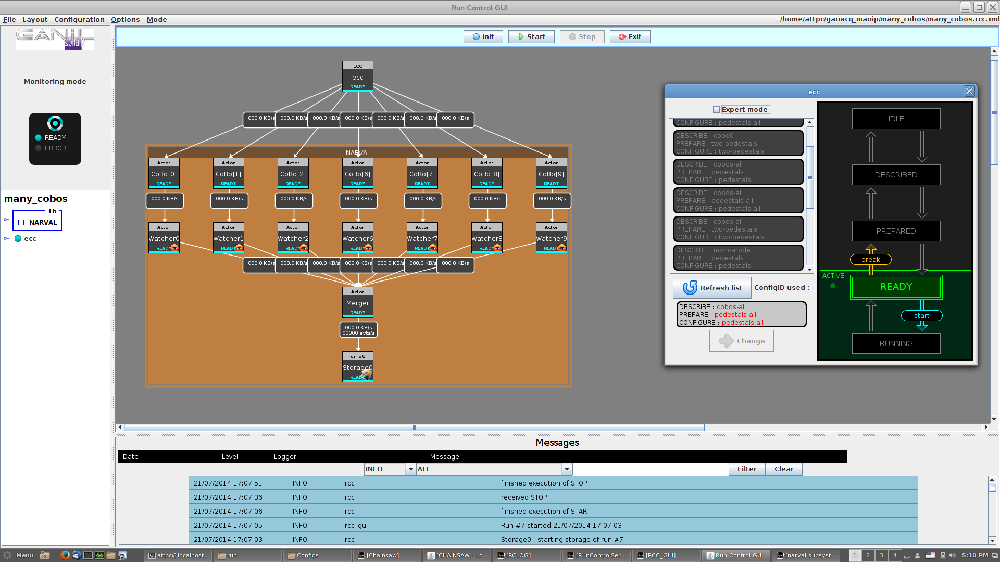
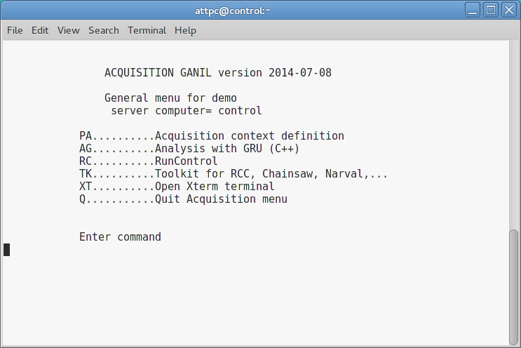

..  highlight:: bash

Components of the DAQ system
============================

The GANIL DAQ system is made up of several interacting components.

..  _narval:

NARVAL
------

NARVAL does the majority of the work in the system, as it is the program that actually acquires the data. Its controlling processes run on the Control computer, and the data acquisition processes for each CoBo run on the individual Mac Minis. You don't really interact with NARVAL directly; instead, it is controlled by the :ref:`rcc`. 

..  warning::

	NARVAL communicates with itself internally using SSH. Therefore, SSH host key authentication *must* be configured on all computers running NARVAL. 

..  warning::

	NARVAL subsystems will not launch correctly if :command:`tcsh` is not the default shell. Additionally, the :file:`SetEnvACQ_ATTPC` script must be sourced by default in :file:`~/.tcshrc`.

..  _rcc:

Run Control Core (RCC) Server
-----------------------------

This part of the system controls runs and sends the commands to start and stop hardware and NARVAL. It knows about the topology of the DAQ setup, but it isn't aware of how each component works. It controls devices through the :ref:`ecc`. 

This should only be run on the control computer.

..  _rccgui:

RCC GUI
-------

This Java GUI is the main way to interact with the system. The interface can be used to start and stop runs and to describe the topology of the system. This program can be run from any computer, but should mainly be used on the control computer. 

RCLOG
-----

This collects log messages from the RCC server. It should be launched automatically on the control computer, and that's all that really needs to be done with it.

..  _ecc:

GET Electronics Control Core (ECC) Server
-----------------------------------------

This is a program from the GET software that controls the electronics. It is compiled separately from the rest of the DAQ system, and it's installed under :file:`/daq/GET`. One instance of this program runs on each Mac Mini to control each associated CoBo.

Setup and Control
^^^^^^^^^^^^^^^^^

For convenience, ECC server is controlled by the Linux systemd process. This has the benefit of launching ECC automatically at boot and automatically restarting the process if it dies. To allow systemd to do this, we use a script located at :file:`/etc/systemd/system/ecc.service` on each Mac Mini. This script has the following contents:

..  code-block:: ini

	[Unit]
	Description=GET ECC Soap Server

	[Service]
	ExecStart=/daq/GET/latest/software/pkg/bin/getEccSoapServer --config-repo-url /daq/Configs
	Environment="LD_LIBRARY_PATH=/daq/GET/latest/software/pkg/lib:$LD_LIBRARY_PATH"

	[Install]
	WantedBy=multi-user.target

The first block of the script provides a description of the service. The second block contains the command to be run to start the service (under ``ExecStart``) and the environment variables needed by the program (under ``Environment``). The environment variables need to provide the location of the dynamically linked libraries required by the ECC server program. The option :option:`--config-repo-url` should contain the path to the config files on the local machine. The final block tells systemd when to start the process. The option shown will start it by default when the computer is booted in non-GUI mode.

Once this has been set up, the service can be started, stopped, and restarted by running these commands::

	$ sudo systemctl start ecc
	$ sudo systemctl stop ecc
	$ sudo systemctl restart ecc

To make the service start by default, use::

	$ sudo systemctl enable ecc

You might still have to start it manually after this.

Viewing Logs
^^^^^^^^^^^^

This method causes ECC server to be run in the background as a service, so the logs will, of course, not be printed to a terminal. The output of the program is instead cached by systemd in the linux kernel's system logs. This can be viewed by using this command::

	$ journalctl -u ecc

Scroll through this by using the same commands as you would use for, e.g., manual pages.

Config files
^^^^^^^^^^^^

The config files for the ECC server should be kept in the directory :file:`/daq/Configs` on the Control computer. This directory is exported on that computer through NFS and mounted at the same location in the filesystem on each Mac Mini.

The system uses three different config files to configure each CoBo, though two of them can be identical. The three types of files are named as follows:

	- :samp:`describe-{NAME}.xcfg` -- Identifies the hardware used and provides IP addresses
	- :samp:`prepare-{NAME}.xcfg` -- Used for configuring parameters of the CoBos
	- :samp:`configure-{NAME}.xcfg` -- Used for configuring parameters of the CoBos

The last two files may be identical, and it's easiest to make the ``prepare-`` file a symlink to the ``configure-`` file.

Due to the fact that we are running up to 10 instances of GET ECC Server, we need to use separate ``describe-`` files for each CoBo. Each ECC server instance will then be configured to control only the CoBo identified in the particular ``describe-`` file it is given. The actual configuration information, however, can all be kept in one unified ``prepare-``/``configure-`` file.

..  _scripts:

GANIL Scripts
-------------

GANIL provides a collection of scripts to start and stop the various components of the system. These provide a menu for starting the software.

