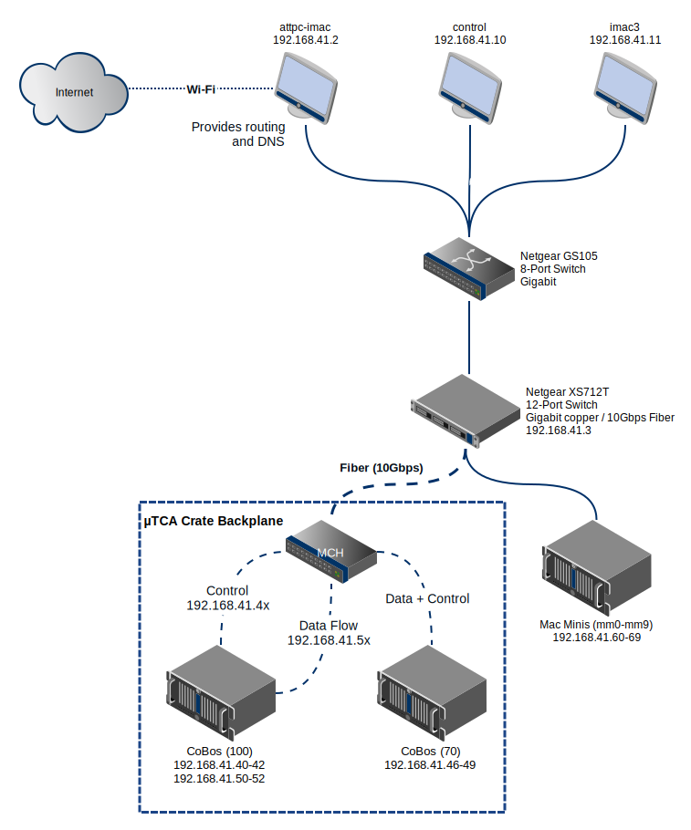

Computer roles and network layout
=================================

Each computer in the DAQ network plays a particular role.

Control computer
----------------

This is the Dell tower that's currently on a movable computer cart. Its purpose is to compile the DAQ system, run :ref:`rcc`, and control the acquisition of data. 

+--------------------+-------------------+
|      Property      |       Value       |
+====================+===================+
| Hostname           | ``control.local`` |
+--------------------+-------------------+
| IP Address         | ``192.168.41.10`` |
+--------------------+-------------------+
| Operating System   | Fedora 20         |
+--------------------+-------------------+
| GUI on by default? | Yes               |
+--------------------+-------------------+

Mac Minis
---------

These are in the server rack next to the ATTPC. Each one is responsible for acquiring, processing, and storing the data from one CoBo.

+--------------------+-------------------------+
|      Property      |          Value          |
+====================+=========================+
| Hostname           | :samp:`mm{X}.local`     |
+--------------------+-------------------------+
| IP Address         | :samp:`192.168.41.6{X}` |
+--------------------+-------------------------+
| Operating System   | Fedora 20               |
+--------------------+-------------------------+
| GUI on by default? | No                      |
+--------------------+-------------------------+

Left iMac
---------

This computer is used for analysis. It is also the gateway to the Internet for the rest of the DAQ computers, and it controls routing and DNS lookup for these computers as well. The DHCP and DNS functions are controlled by the OS X Server app. 

It is also still used for flashing firmware onto the CoBos, for debugging CoBos, and for controlling the CoBo power supply, though these tasks could be pushed off onto the Control computer in the future.

+--------------------+---------------------------------+
|      Property      |              Value              |
+====================+=================================+
| Hostname           | ``attpc-iMac.local``            |
+--------------------+---------------------------------+
| IP Address         | ``192.168.41.2``,               |
|                    | (External Address also present) |
+--------------------+---------------------------------+
| Operating System   | Mac OS X 10.9                   |
+--------------------+---------------------------------+
| GUI on by default? | Yes                             |
+--------------------+---------------------------------+

Network topology
----------------

The diagram below shows the layout of the local DAQ network.

