Setting up an experiment
========================

It takes a bit of work to set up an experiment the first time. The main tasks are to:

  - Set up the required directories
  - Describe the components of the system
  - Describe the connections between these components
  - Distribute this information to the Mac Minis
  
Most of this can be done within the RCC GUI.
    
..  note::
    
    Throughout this process, make sure to save frequently with :kbd:`Ctrl-s`.

Initializing the experiment
---------------------------

Start by running the script :file:`start_ACQ` (located in the :file:`/daq/ACQ_HOST/latest/Scripts` directory). This should be in the environment's :envvar:`PATH` variable already, so it can be run from any working directory. The script takes one argument: the name of the experiment to be created. For example, to start an experiment called "demo", run this command in a terminal:

..  code-block:: bash
    
    $ start_ACQ demo
    
This will ask a series of questions. Respond as follows:

  #. Say yes to create the root directory of the experiment (under :file:`~/ganacq_manip`)
  #. Accept the default data storage path (:file:`/data/attpcX`)
  #. Press enter to finish
  
Now you should see the main menu:

..  image:: images/acqmenu.png

Type :kbd:`pa Enter` to edit some experiment variables. This will bring up a :command:`nedit` window.

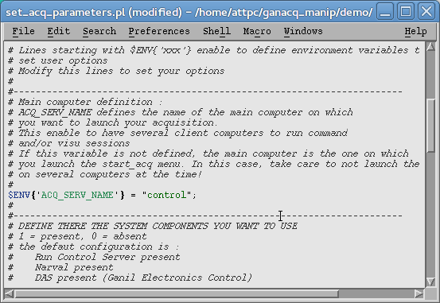

Scroll down and find the following section:

..  code-block:: perl

    # Main computer definition :
    # ACQ_SERV_NAME defines the name of the main computer on which 
    # you want to launch your acquisition.
    # This enable to have several client computers to run command
    # and/or visu sessions
    # If this variable is not defined, the main computer is the one on which
    # you launch the start_acq menu. In this case, take care to not launch the same experiment 
    # on several computers at the time!
    #
    #$ENV{'ACQ_SERV_NAME'} = "ganp670";
    
Uncomment the last line of this and change it to say

..  code-block:: perl

    $ENV{'ACQ_SERV_NAME'} = "control";
    
This tells the system that the computer with the hostname "control" will be running RCC server and controlling the experiment. Save this file and close it to return to the main menu.

At this point, we're ready to launch the rest of the system. Type :kbd:`rc Enter` to launch NARVAL, RCC, the RCC GUI, and the rest of the components. Be patient as this takes a moment and opens a lot of windows.

Describing the equipment
------------------------

Once the RCC GUI window appears, we can start to describe the DAQ topology. Initially, the window will be empty:

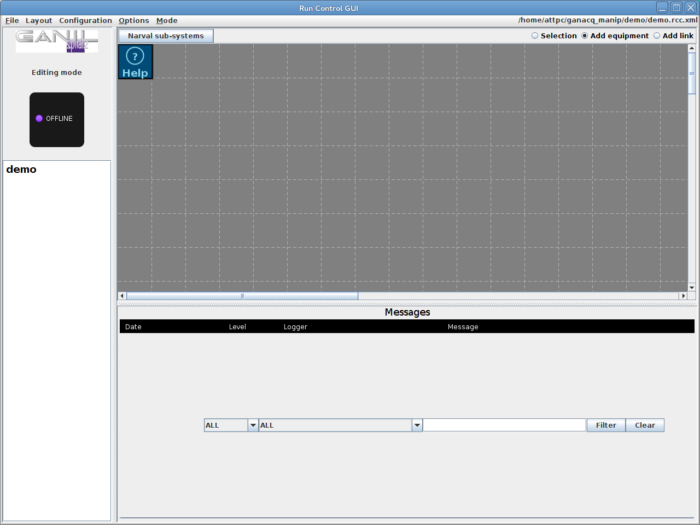

Adding a NARVAL subsystem
+++++++++++++++++++++++++

Start by adding a NARVAL subsystem for the data acquisition. Click on :guilabel:`Narval sub-systems` at the top of the window and then click :guilabel:`New` in the window that appears. Then fill in the following information

+----------------+-------------------------+
|Item            | Value                   |
+================+=========================+
|Name            | ``Acquisition``         |
+----------------+-------------------------+
|Hostname        | ``192.168.41.10``       |
+----------------+-------------------------+
|Coordinator CPU | ``192.168.41.10``       |
+----------------+-------------------------+

Adding components
+++++++++++++++++

To add a component, click anywhere in the grid and then click the green :guilabel:`OK` button. 

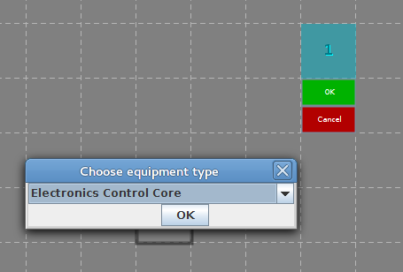

Start by adding the ECC server. In the :guilabel:`Choose equipment type` window, choose "Electronics Control Core" and press :guilabel:`OK`. Name it "ECC" (or anything else reasonable), give it the HostName ``192.168.41.10`` (the IP address of the control computer), and leave the port as ``8083``. Press :guilabel:`Add 1 ECC` and the server will appear on the grid.

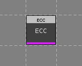

Next we need to add the components that collect data from each CoBo. Start by clicking on the grid and adding a component of the type "Narval actor defined by a template file". Enter these values:

+------------------+----------------------------------+
|Item              | Value                            |
+==================+==================================+
|Name              | :samp:`CoBo[{X}]`                |
+------------------+----------------------------------+
|HostName          | :samp:`192.168.41.6{X}`          |
+------------------+----------------------------------+
|Log Level         | (any)                            |
+------------------+----------------------------------+
|Template file     | ``gnarval_mfm_catcher.template`` |
+------------------+----------------------------------+
|Narval sub-system | ``Acquisition``                  |
+------------------+----------------------------------+

The window should look like this when filled in, except the :guilabel:`Narval sub-system` field should be automatically filled with the name of the subsystem you made in the first step:

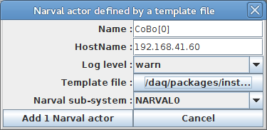

..  warning::
    
    The name of the MFM catcher *must* match the name of a CoBo in the configuration files given to ECC server. Generally, the file calls the CoBos ``CoBo`` and then indexes them, hence ``CoBo[0]``, ``CoBo[1]`` etc. are appropriate names.
    
Optionally, add a component of the type "MFM Narval Watcher actor". Fill in

+------------------+----------------------------------+
|Item              | Value                            |
+==================+==================================+
|Name              | :samp:`Watcher{X}`               |
+------------------+----------------------------------+
|HostName          | :samp:`192.168.41.6{X}`          |
+------------------+----------------------------------+
|Log Level         | (any)                            |
+------------------+----------------------------------+
|Narval sub-system | ``Acquisition``                  |
+------------------+----------------------------------+

And finally add a component of the type "MFM Narval Storage actor" with the same settings as the watcher actor, but with the name :samp:`Storage{X}`.

Repeat this process for each CoBo.

Linking components
++++++++++++++++++

Once we've added all of the components, we need to tell RCC how they're connected to each other. Do this by adding links. At the top of the window, choose :guilabel:`Add link`. This changes the behavior of the mouse so that clicking in the grid area will add a link between components.

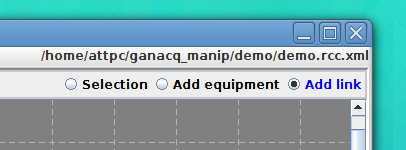

Click and drag from one component to another to add a link. The links between the ECC and the MFM Catchers need to be set up using these options:

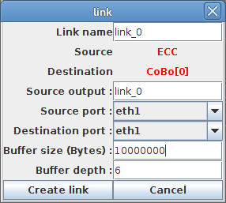

Note that I've selected ``eth1`` for both ports and added two zeros to the buffer size. The rest of the settings are the defaults. The name of the link is not important, but it must be unique.

For links between NARVAL components, use these settings:

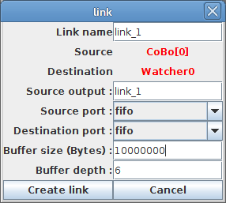

This time, everything is left as the default except for the buffer size.

When you've finished linking components, the layout should look something like this:

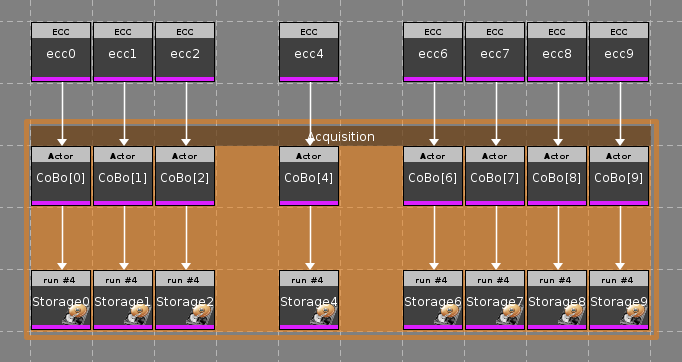

    
Start and stop configurations
-----------------------------

Next, we must tell RCC what order to start and stop the components in when we start and stop runs. In the menu bar, choose :guilabel:`Configuration->Start configuration`. Add components to the list such that all of the NARVAL subsystems start *before* ECC starts. That way, the computers will be ready when data starts to flow.

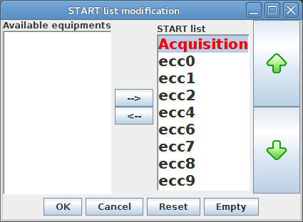

Now, choose :guilabel:`Configuration->Stop configuration` and arrange the components in the opposite order (or, just make sure that ECC stops first):

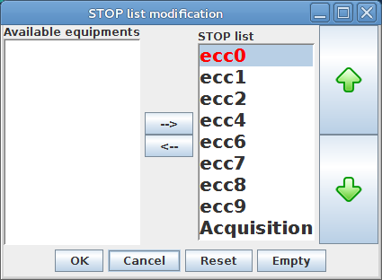

Distributing the configuration to the Mac Minis
-----------------------------------------------

Next, we need to run a script to create the data directories on the Mac Minis. Otherwise RCC will complain that it can't store data because the directories do not exist. To do this, open a terminal and execute the following commands:

..  code-block:: bash

    $ cd ~/ansible-attpc/distrib-experiment
    $ ansible-playbook distribute.yml -f 10 --extra-vars "exp_name=[experiment name]"

Replace ``[experiment name]`` with the name of your experiment. (This is described in more detail in :doc:`distrib-experiment`.)

Once this finishes, you should be ready to take data.
    

