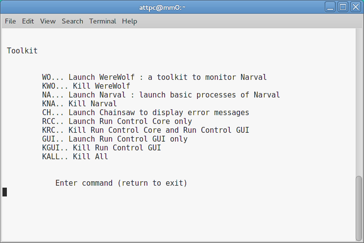
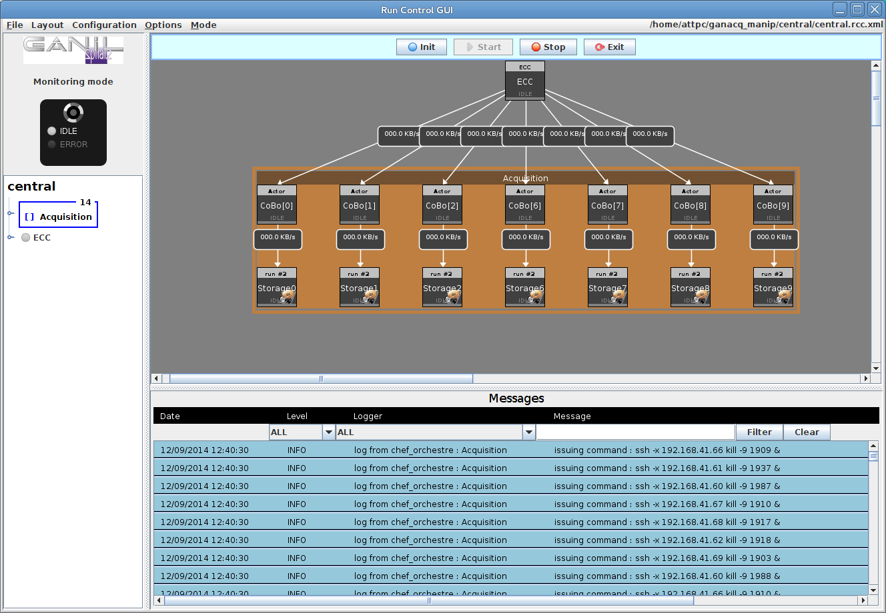
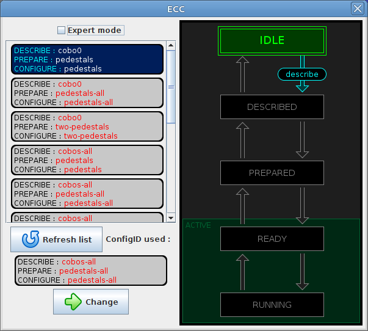
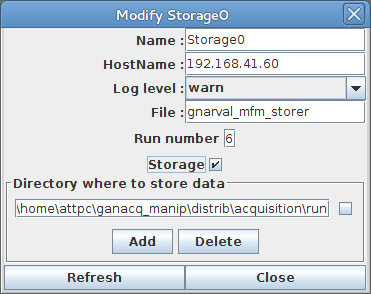
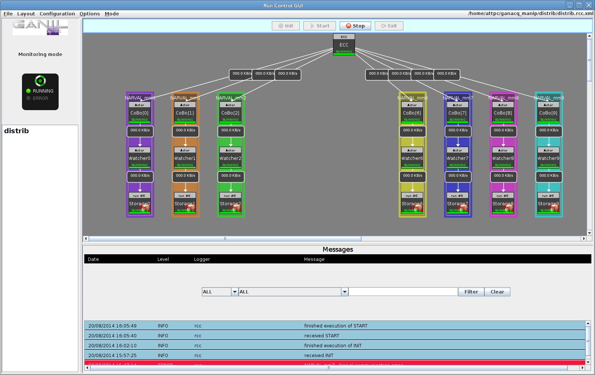

Taking data
===========

To take data with the system, we need to complete the following tasks:

  - Launch NARVAL on each Mac Mini
  - Launch ECC server
  - Start and stop runs
  - Fetch data
  
You should have already set up an experiment as described in :doc:`exp_setup` before continuing.

Launching NARVAL on the Mac Minis
---------------------------------

..  note:: 
    
    This section is preliminary.
    
Open a terminal window and ssh into the first Mac Mini:

..  code-block:: bash

    $ ssh mm0
    
..  note::

    The SSH config file should be set up to automatically provide X forwarding. If it isn't, then use the flags :option:`-XYC` with this command.
    
Once connected, open the main menu by executing

..  code-block:: bash

    $ start_ACQ [experiment name]
    
where ``[experiment name]`` is the name of your experiment. At the main menu, type :kbd:`tk Enter` to choose Toolkit and then type :kbd:`na Enter` to launch NARVAL.

Repeat this step for each Mac Mini in a new tab, keeping each SSH connection open.

Launching ECC server
--------------------

GET ECC server should be launched on the control computer. Open another terminal window and either run the script :file:`/daq/start_ecc_server.sh` or execute the commands

..  code-block:: bash

    $ bash
    $ source /daq/GET/latest/GETUP
    $ getEccSoapServer --config-repo-url /daq/GET/latest/runtime/Configs/
    
..  note::

    The path given for :option:`--config-repo-url` should be whatever path contains the config files for the CoBos.
    
Leave this running in the background.

Preparing RCC GUI
-----------------

Open the main menu on the control computer and launch RCC server using :kbd:`rc Enter`. Once RCC GUI appears, go to :guilabel:`Mode -> Monitoring mode`. After a moment, all components should show that they are in the "Idle" state. 

Right-click on the ECC component and choose :guilabel:`Specific command panel`. This opens the window that we can use to interact with the ECC server.

Choose the correct combination of config files from the list and press :guilabel:`Change`. Either close this window or drag it out of the way.

Controlling runs
----------------

At the top of the main RCC GUI window, there are buttons to control the runs. 

..  image:: images/control_buttons.png

The buttons do the following:

Init
    Configures the equipment and launches NARVAL subsystems. After this finishes, the system should be ready to collect data.
    
Start
    Starts acquisition.
    
Stop
    Stops acquisition.
    
Exit
    Un-configures the equipment and closes NARVAL subsystems. This is like resetting the system.
    
Begin by pressing :guilabel:`Init`. This will take a while, and the progress can be monitored in the terminal window that's running :command:`getEccSoapServer`.

..  note:: 

    Once the NARVAL subsystems initialize, an :command:`xterm` window for each one will pop up on the screen. These can be minimized, but they must be left open. Also note that these are running on the Mac Minis, but are being shown on the control computer due to X forwarding.
    
Once initialization has finished, everything should show a "Ready" state (teal). 

Now we have to enable storage on each Mac Mini. Right-click on each Storage component and choose :guilabel:`Modify`. In the window that pops up, enable the checkbox :guilabel:`Storage` and click :guilabel:`Close`.

..  note::

    If you don't want to store data, there's no need to complete this step. This can be useful for checking to make sure everything is working before actually starting a data-taking run. 
    
Now, click :guilabel:`Start` to start a run. If you've enabled storage, a window will pop up to take a comment for the run. This can be changed or left as the default. When everything is running, the window should look like this:

To stop a run, click :guilabel:`Stop`. If you want to reset the system, click :guilabel:`Exit`.

Fetching data
-------------

At this point, all of the data is still on the Mac Minis. To fetch it to the control computer, open a terminal and use the following commands

..  code-block:: bash

    $ cd ~/ansible-attpc/fetch-data
    $ ansible-playbook fetch.yml -f 10
    $ ./rearrange_data.pl [experiment name]
   	
These scripts are documented at :doc:`fetch-data` and :doc:`rearrange_data`. After running them, the data should be found in :file:`/data/cleaned/[experiment name]`.

