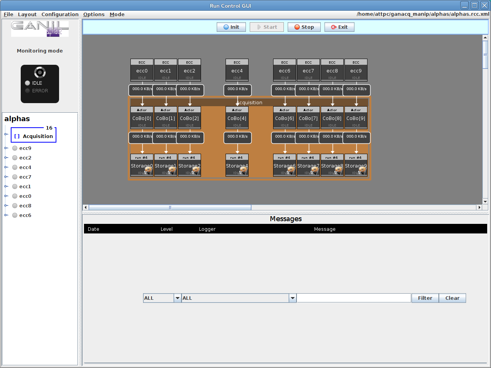
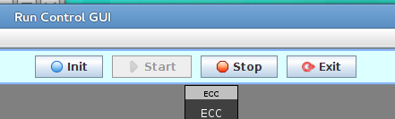

Taking data
===========

To take data with the system, we need to complete the following tasks:

  - Launch ECC server
  - Start and stop runs
  - Fetch data
  
You should have already set up an experiment as described in :doc:`exp_setup` before continuing.

Launching ECC server and the Main Menu
--------------------------------------

The easiest way to do this is to run the script :file:`start_DAQ.sh` on the desktop of the control computer. This will open a terminal window with two tabs: one for ECC server and another for the main menu.

To do this manually, start by opening a terminal window and running these commands:

..  code-block:: bash

    $ bash
    $ source /daq/GET/latest/GETUP
    $ getEccSoapServer --config-repo-url /daq/GET/latest/runtime/Configs/
    
..  note::

    The path given for :option:`--config-repo-url` should be whatever path contains the config files for the CoBos.
    
Leave this running in the background. Then, open the Main Menu in another terminal window by running 

..  code-block:: bash

    $ start_ACQ [experiment name]

Preparing RCC GUI
-----------------

From the main menu, launch RCC server by typing :kbd:`rc Enter`. Once RCC GUI appears, go to :guilabel:`Mode -> Monitoring mode`. After a moment, all components should show that they are in the "Idle" state. 

Right-click on the ECC component and choose :guilabel:`Specific command panel`. This opens the window that we can use to interact with the ECC server.

..  image:: images/ecc_panel.png

Choose the correct combination of config files from the list and press :guilabel:`Change`. Either close this window or drag it out of the way.

Controlling runs
----------------

At the top of the main RCC GUI window, there are buttons to control the runs. 

The buttons do the following:

Init
    Configures the equipment and launches NARVAL subsystems. After this finishes, the system should be ready to collect data.
    
Start
    Starts acquisition.
    
Stop
    Stops acquisition.
    
Exit
    Un-configures the equipment and closes NARVAL subsystems. This is like resetting the system.
    
Begin by pressing :guilabel:`Init`. This will take a while, and the progress can be monitored in the terminal window that's running :command:`getEccSoapServer`.

..  note:: 

    Once the NARVAL subsystems initialize, an :command:`xterm` window for each one will pop up on the screen. These can be minimized, but they must be left open.
    
Once initialization has finished, everything should show a "Ready" state (teal). 

Now we have to enable storage on each Mac Mini. Right-click on each Storage component and choose :guilabel:`Modify`. In the window that pops up, enable the checkbox :guilabel:`Storage` and click :guilabel:`Close`.

..  image:: images/storage_enable.png

..  note::

    If you don't want to store data, there's no need to complete this step. This can be useful for checking to make sure everything is working before actually starting a data-taking run. 
    
Now, click :guilabel:`Start` to start a run. If you've enabled storage, a window will pop up to take a comment for the run. This can be changed or left as the default. When everything is running, the status indicator on each NARVAL actor should be green.

To stop a run, click :guilabel:`Stop`. If you want to reset the system, click :guilabel:`Exit`.

Fetching data
-------------

At this point, all of the data is still on the Mac Minis. To fetch it to the control computer, open a terminal and use the following commands

..  code-block:: bash

    $ cd ~/ansible-attpc/fetch-data
    $ ansible-playbook fetch.yml -f 10
    $ ./rearrange_data.pl [experiment name]
   	
These scripts are documented at :doc:`fetch-data` and :doc:`rearrange_data`. After running them, the data should be found in :file:`/data/cleaned/[experiment name]`.

Quitting the system
-------------------

To quit all of the components of the system, go to the terminal window hosting the main menu and type :kbd:`tk Enter` to get to the :guilabel:`Toolkit`. From there, type :kbd:`kall Enter` to kill all components of the system. From there, follow the prompts to exit the main menu. 

